# Автотесты на сайт StopGame.ru

## 💼 О проекте

🎮Данный проект создан для тестирования сайта [StopGame.ru](https://stopgame.ru/)

🛠️Используемый стэк в проекте

 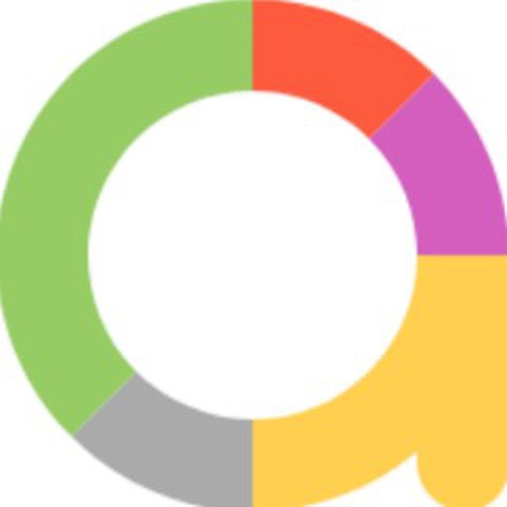   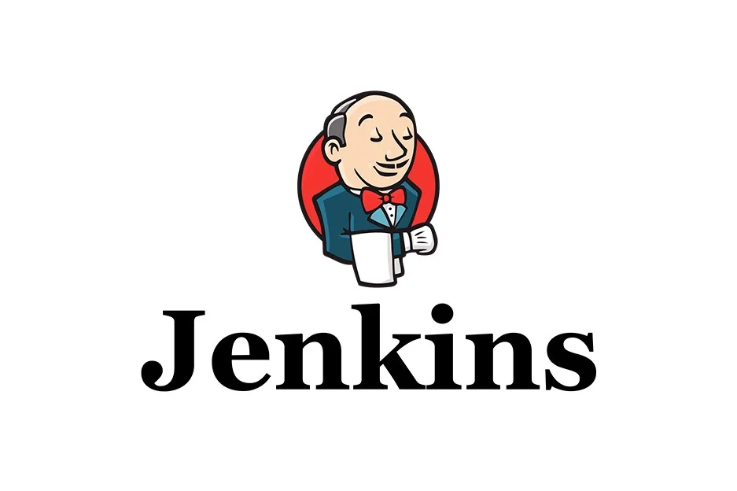 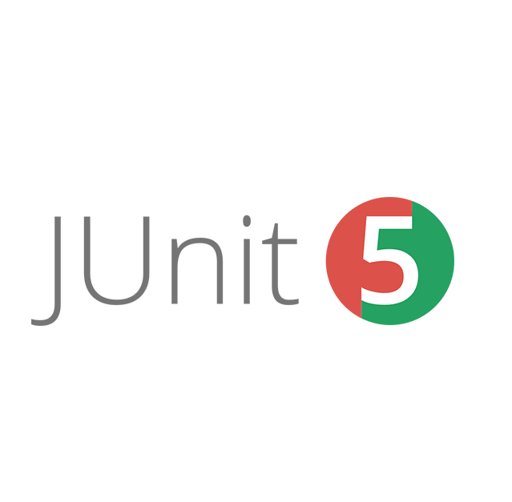 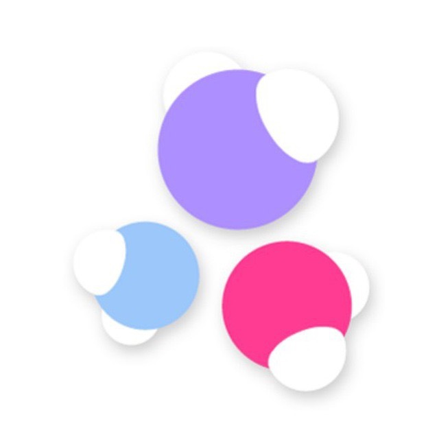   
---

🧰Список тестов в проекте

📅 UI тесты

+ **Open site** - тест, проверяющий открытие страницы

+ **Login - Logout** - тест, проверяющий работы входа и выхода в учетную запись

+ **Searching all** - параметризированный тест, проверяющий работу поиска по сайту

+ **Open About resource page** - тест, проверяющий работу раздела "О проекте"

+ **Checking tags** - тест, проверяющий работу тэгов внутри страниц игр

+ **Checking developers** - тест, проверяющий работу разработчиков внутри страниц игр

+ **Checking last comment** - тест, проверяющий раздел последних комментариев и переход к ним

+ **Adding the game to the profile** - тест, проверяющий возможность добавить и удалить игру в свой профиль

+ **Searching Users** - тест, проверяющий работу поиска юзеров по сайту

+ **Social networks check** - тест, проверяющий наличие ссылок на социальные сети

🛃 API тесты

+ **Login via API** - тест, проверяющий возможность залогиниться через API

+ **Add the game via API - authorized** - тест, проверяющий возможность добавить в профиль авторизированного пользователя игру через API

+ **Add the game via API - not authorized** - тест, проверяющий возможность добавить игру в профиль неавторизированного пользователя через API

+ **Add the news to favourite via API - authorized** - тест, проверяющий возможность добавить новость в избранное в профиль авторизированного пользователя через API 

+ **Add the news to favourite via API - not authorized** - тест, проверяющий возможность добавить новость в избранное в профиль неавторизированного пользователя через API 

📱 Мобильные тесты

❕ Так как у StopGame.ru нет своего мобильного приложения, было решено написать мобильные тесты для приложения Яндекс.Переводчик. ❕

+ **Translation text** - тест, проверяющий перевод текста с одного языка на другой

+ **Switching language** - тест, проверяющий работу смены языка

+ **Open Settings** - тест, проверяющий работу кнопки Настройки (Settings)

---
🤖Пример прохождения теста ***Adding the game to the profile***:

---
## 🏗️ Сборка

👨‍✈️ Сборка проекта происходит через Jenkins

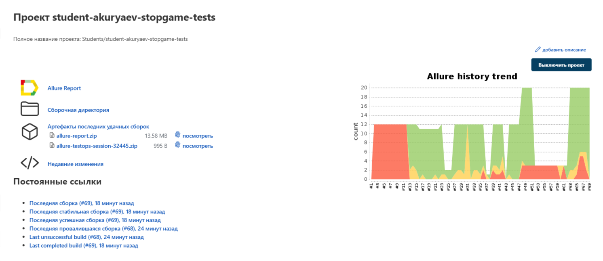

⚙️ Также в Jenkins реализован выбор параметров запуска сборки

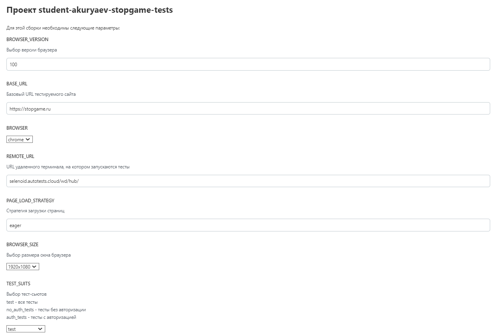

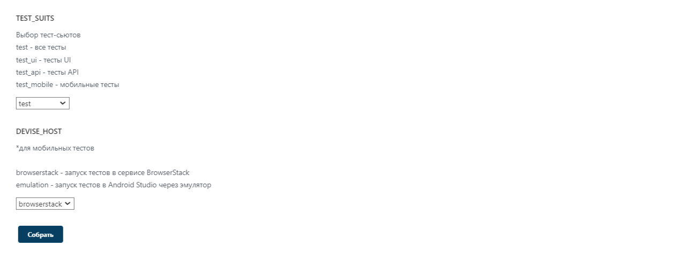

---

## 📑 Отчетность

📃 В Jenkins реализована интеграция с Allure

Allure Reports
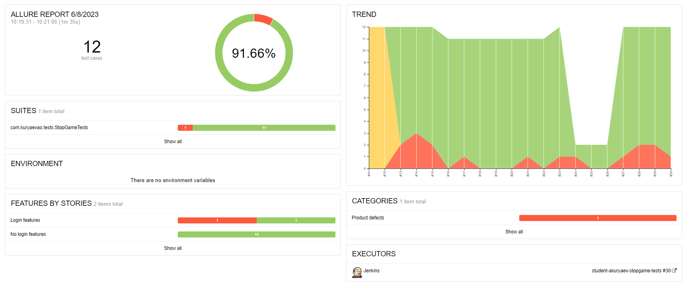

Allure TestOps
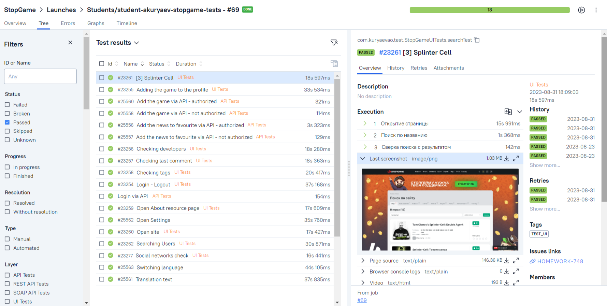

Allure TestOps dashboards
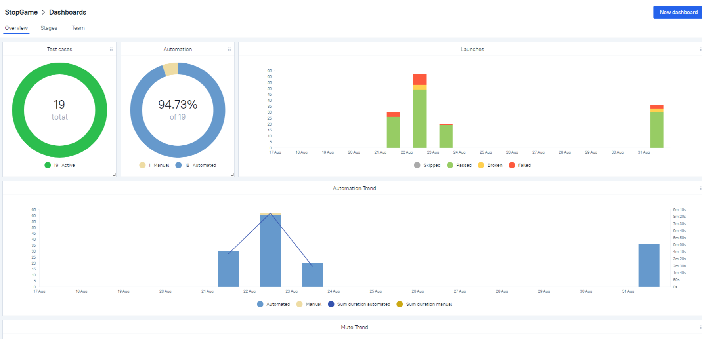
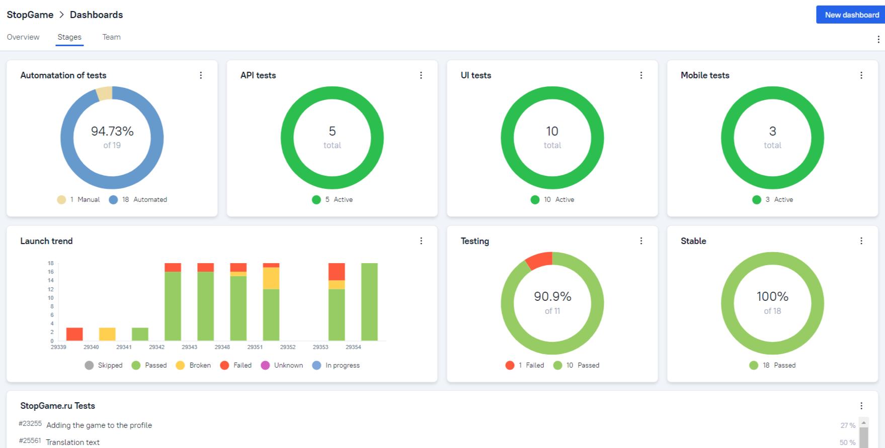

 Также реализована интеграция с ботом Telegram

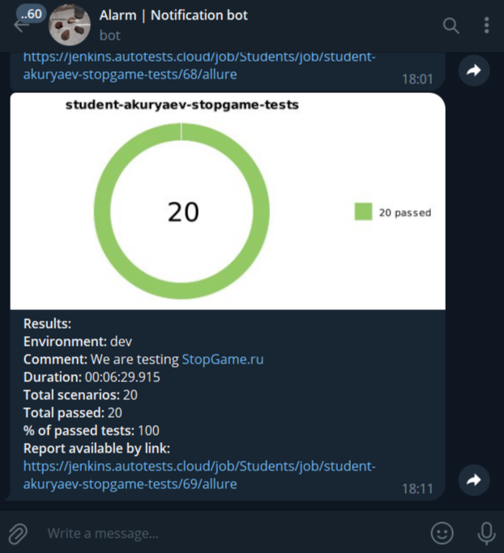

